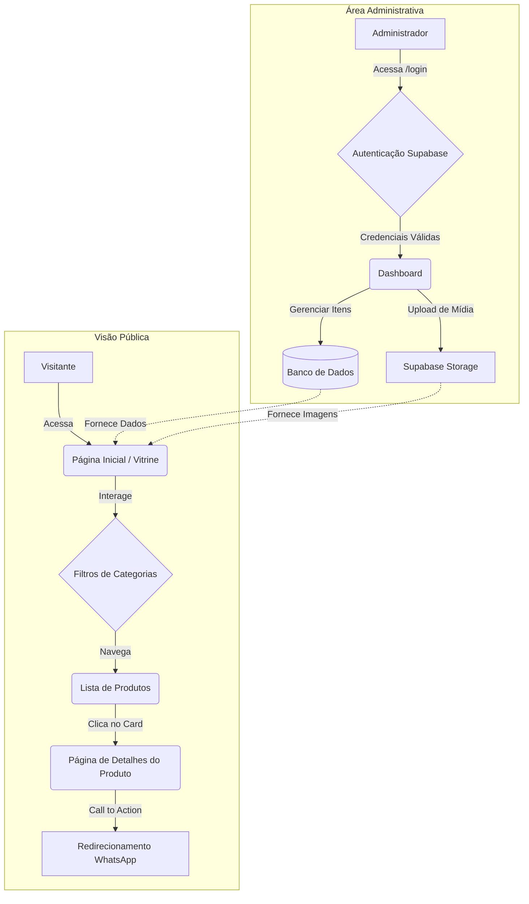

# Cacarecos & Amenidades

Uma plataforma digital desenvolvida para gerenciar e exibir itens de desapego e doações. Criado com uma arquitetura moderna, design focado em UX (mobile-first) e painel administrativo integrado.

O objetivo principal deste projeto é facilitar a reserva de itens que eu e minha noiva estamos desapegando para investir na nossa casa, no nosso casamento ou em itens que vão acabar vindo pra cá.

## Stack Tecnológico

* **Frontend:** React + Vite
* **Roteamento:** React Router (HashRouter para compatibilidade estática)
* **Estilização:** CSS customizado (abordagem Mobile-First baseada em tokens de design)
* **Backend as a Service:** Supabase (PostgreSQL)
* **Autenticação:** Supabase Auth
* **Storage:** Supabase Storage (Buckets para upload de imagens)
* **Ícones:** Lucide React

## Arquitetura e Fluxo de Navegação

Abaixo está o diagrama do fluxo principal da aplicação, separando a experiência do visitante e do administrador.

